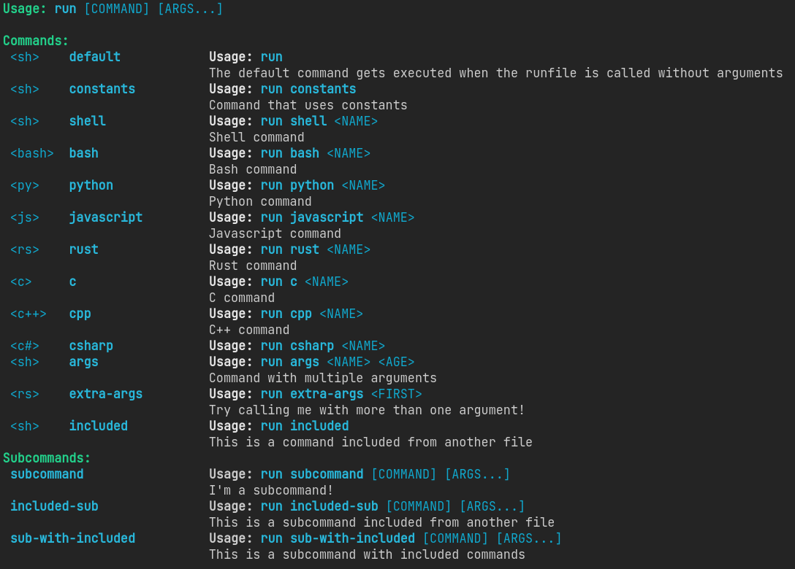

[](https://crates.io/crates/runfile)


[](https://crates.io/crates/runfile)

> Run commands in the languages you love!



Create scripts with multiple commands easily with `run`.  
You can write a command in any of the [supported languages](#languages), and even mix them!

And, if you have [`nix`](https://nixos.org/) installed, `run` will fetch the necessary packages automatically, there's no need to have any toolchain installed.

## Features
- Run commands in multiple languages seamlessly
- Fetch language toolchains automatically with `nix`
- Module system to reuse scripts
- Supports both commands and subcommands
- Self-contained in a single binary, no extra dependencies
- `runfiles` are just text files, easy to share and version control

## Languages
`run` supports the following languages, with their respective command indicators:

- [Rust](https://www.rust-lang.org/): `rust | rs`
- [Python](https://www.python.org/): `python | py`
- [Javascript](https://nodejs.org/): `javascript | js`
- [Shell](https://en.wikipedia.org/wiki/Shell_script): `shell | sh`
- [Bash](https://en.wikipedia.org/wiki/Bash_(Unix_shell)): `bash`
- [C#](https://docs.microsoft.com/en-us/dotnet/csharp/): `csharp | cs | c#`
- [C](https://en.wikipedia.org/wiki/C_(programming_language)): `c`
- [C++](https://en.wikipedia.org/wiki/C%2B%2B): `cplusplus | cpp | c++`

If you want a language to be added, please open an issue or a pull request following the steps in [CONTRIBUTE.md](CONTRIBUTE.md).

## Installation
Download the latest installer from the [releases page](https://github.com/LyonSyonII/run/releases).

Or compile it yourself with `cargo`:

```sh
cargo install runfile
```

### VSCode Extension
There's a VSCode extension that provides syntax highlighting for `runfile` scripts.

It's experimental, so you'll need to install it manually.

[Download the latest `.vsix`](https://github.com/LyonSyonII/run/raw/refs/heads/main/extension/runfile-0.0.1.vsix) and run `code --install-extension runfile-0.0.1.vsix` to install it.

## Usage
> `runfile` is to `run` what `makefile` is to `make`

Create a `runfile` wherever you want, and write your commands in it.  
Then, run `run` in the same directory as the `runfile` to execute the commands.

The possible names for the `runfile` are: `run`, `runfile` or any file with the `.run` extension.

If you want to see the available commands run `run --commands`, or `run --help` for more information.

### How to write a `runfile`


See the `runfile` in the screenshot [here](examples/runfile.run).

## Contributing
Contributions are welcome!
If you want to add a new language, follow the steps in [CONTRIBUTE.md](CONTRIBUTE.md).

## License
This project is licensed under the [GPL-3.0](LICENSE) license.
